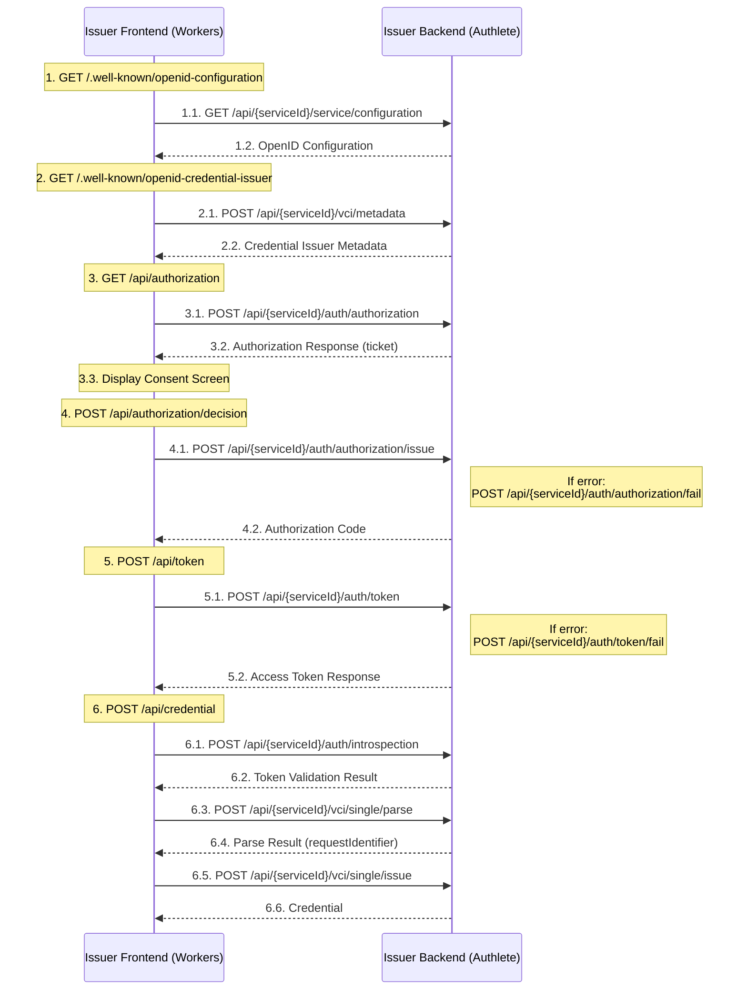

# Frontend to Backend OpenID4VCI Sequence



## Request / Response parameters

> [!NOTE]
> リクエスト/レスポンスパラメータの詳細な情報は[Backend API](../api/backend/)を参照してください。

### 1. OpenID Configuration Request
Frontend が `/.well-known/openid-configuration` へのリクエストを受け取ると：

#### 1.1. GET /api/{serviceId}/service/configuration
Authlete の service configuration エンドポイントを呼び出し

URL: `https://nextdev-api.authlete.net/api/{serviceId}/service/configuration`  
Method: GET

Headers:
- Authorization: Bearer {アクセストークン}

Parameters:
- pretty: boolean (optional) - レスポンスのJSONを整形するかどうか

#### 1.2. OpenID Configuration Response
設定情報を取得して返却

```json
{
  "issuer": "https://issuer.g-trustedweb.workers.dev",
  "authorization_endpoint": "https://issuer.g-trustedweb.workers.dev/api/authorization",
  "token_endpoint": "https://issuer.g-trustedweb.workers.dev/api/token",
  "scopes_supported": ["openid", "org.iso.18013.5.1.mDL"],
  "response_types_supported": ["code"]
}
```

### 2. Credential Issuer Metadata Request
Frontend が `/.well-known/openid-credential-issuer` へのリクエストを受け取ると：

#### 2.1. POST /api/{serviceId}/vci/metadata
Authlete の VCI metadata エンドポイントを呼び出し

URL: `https://nextdev-api.authlete.net/api/{serviceId}/vci/metadata`  
Method: POST

Headers:
- Content-Type: application/json
- Authorization: Bearer {アクセストークン}

Request Body:
```json
{
  "pretty": false
}
```

#### 2.2. Credential Issuer Metadata Response
メタデータを取得して返却

```json
{
  "action": "OK",
  "responseContent": {
    "credential_issuer": "https://issuer.g-trustedweb.workers.dev",
    "credential_endpoint": "https://issuer.g-trustedweb.workers.dev/api/credential",
    "credentials_supported": [
      {
        "format": "mso_mdoc",
        "doctype": "org.iso.18013.5.1.mDL"
      }
    ]
  }
}
```

### 3. Authorization Request
Frontend が `/api/authorization` へのリクエストを受け取ると：

#### 3.1. POST /api/{serviceId}/auth/authorization
Authlete で認可リクエストを検証

URL: `https://nextdev-api.authlete.net/api/{serviceId}/auth/authorization`  
Method: POST

Headers:
- Content-Type: application/json
- Authorization: Bearer {アクセストークン}

Request Body:
```json
{
  "parameters": "response_type=code&client_id={クライアントID}&scope=org.iso.18013.5.1.mDL+openid&redirect_uri=eudi-openid4ci://authorize/&code_challenge={code_challenge}&code_challenge_method=S256"
}
```

#### 3.2. Authorization Response
チケットを受け取る

```json
{
  "action": "INTERACTION",
  "ticket": "zhL7BleAB6K2AnKcH3rsMKglr4UovSV2687vmtCBNF0"
}
```

#### 3.3. Display Consent Screen
同意画面を表示

### 4. Authorization Decision Request
Frontend が `/api/authorization/decision` へのリクエストを受け取ると：

#### 4.1. POST /api/{serviceId}/auth/authorization/issue
Authlete で認可コードを発行

URL: `https://nextdev-api.authlete.net/api/{serviceId}/auth/authorization/issue`  
Method: POST

Headers:
- Content-Type: application/json
- Authorization: Bearer {アクセストークン}

Request Body:
```json
{
  "ticket": "{チケット}",
  "subject": "{ユーザーID}"
}
```

#### 4.2. Authorization Code Response
認可コードをリダイレクトで返却

```json
{
  "action": "LOCATION",
  "responseContent": "eudi-openid4ci://authorize/?code={認可コード}&state={state}"
}
```

### 5. Token Request
Frontend が `/api/token` へのリクエストを受け取ると：

#### 5.1. POST /api/{serviceId}/auth/token
Authlete でトークンリクエストを検証

URL: `https://nextdev-api.authlete.net/api/{serviceId}/auth/token`  
Method: POST

Headers:
- Content-Type: application/json
- Authorization: Bearer {アクセストークン}

Request Body:
```json
{
  "parameters": "grant_type=authorization_code&code={認可コード}&redirect_uri=eudi-openid4ci://authorize/&code_verifier={code_verifier}",
  "clientId": "{クライアントID}"
}
```

#### 5.2. Access Token Response
アクセストークンを取得して返却

```json
{
  "action": "OK",
  "responseContent": {
    "access_token": "{アクセストークン}",
    "token_type": "Bearer",
    "expires_in": 3600,
    "scope": "openid org.iso.18013.5.1.mDL"
  }
}
```

### 6. Credential Request
Frontend が `/api/credential` へのリクエストを受け取ると：

#### 6.1. POST /api/{serviceId}/auth/introspection
Authlete でアクセストークンを検証

URL: `https://nextdev-api.authlete.net/api/{serviceId}/auth/introspection`  
Method: POST

Headers:
- Content-Type: application/json
- Authorization: Bearer {アクセストークン}

Request Body:
```json
{
  "token": "{アクセストークン}",
  "scopes": [
    "org.iso.18013.5.1.mDL",
    "openid"
  ]
}
```

#### 6.2. Token Validation Result
トークン検証結果を受け取る

```json
{
  "action": "OK",
  "existent": true,
  "usable": true,
  "sufficient": true
}
```

#### 6.3. POST /api/{serviceId}/vci/single/parse
クレデンシャルリクエストを解析

URL: `https://nextdev-api.authlete.net/api/{serviceId}/vci/single/parse`  
Method: POST

Headers:
- Content-Type: application/json
- Authorization: Bearer {アクセストークン}

Request Body:
```json
{
  "accessToken": "{アクセストークン}",
  "requestContent": {
    "format": "mso_mdoc",
    "doctype": "org.iso.18013.5.1.mDL",
    "claims": {
      "org.iso.18013.5.1": {
        "family_name": {},
        "given_name": {}
      }
    }
  }
}
```

#### 6.4. Parse Result
リクエスト解析結果（requestIdentifier）を受け取る

```json
{
  "action": "OK",
  "info": {
    "identifier": "{requestIdentifier}",
    "format": "mso_mdoc"
  }
}
```

#### 6.5. POST /api/{serviceId}/vci/single/issue
クレデンシャルを発行

URL: `https://nextdev-api.authlete.net/api/{serviceId}/vci/single/issue`  
Method: POST

Headers:
- Content-Type: application/json
- Authorization: Bearer {アクセストークン}

Request Body:
```json
{
  "accessToken": "{アクセストークン}",
  "order": {
    "requestIdentifier": "{requestIdentifier}",
    "credentialPayload": {
      "doctype": "org.iso.18013.5.1.mDL",
      "claims": {
        "org.iso.18013.5.1": {
          "family_name": {},
          "given_name": {}
        }
      }
    }
  }
}
```

#### 6.6. Credential Response
クレデンシャルを返却

```json
{
  "action": "OK",
  "responseContent": {
    "credential": "{発行されたクレデンシャル}",
    "c_nonce": "{nonce}",
    "c_nonce_expires_in": 86400
  }
}
```