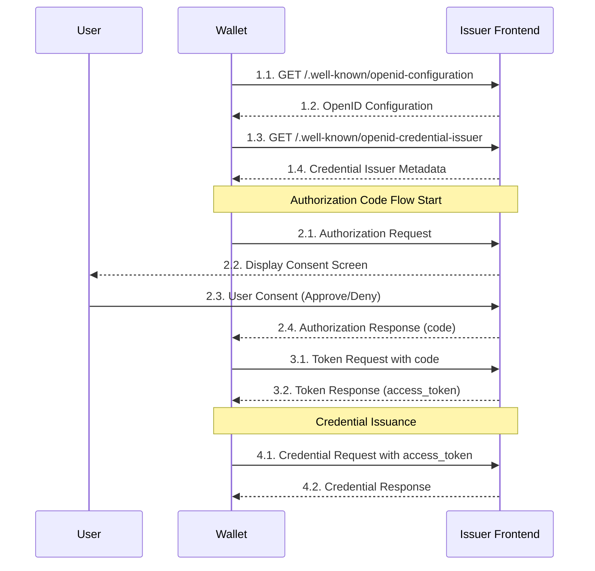

# Wallet to Frontend OpenID4VCI Sequence



## Request / Response parameters

> [!NOTE]
> リクエスト/レスポンスパラメータの詳細な情報は[Frontend API](../api/frontend/)を参照してください。

### 1.1. GET /.well-known/openid-configuration

Wallet は Authorization Server の Well-known Endpoint にリクエストを送信し、OpenID Configuration を取得します。

URL: `https://issuer.g-trustedweb.workers.dev/.well-known/openid-configuration`  
Method: GET

### 1.2. OpenID Configuration

Authorization Server は、OpenID Configuration を返します。詳細なパラメータについては[OpenID Configuration](https://openid.net/specs/openid-connect-discovery-1_0.html#ProviderMetadata)を参照してください。

```json
{
  "issuer": "https://issuer.g-trustedweb.workers.dev",
  "authorization_endpoint": "https://issuer.g-trustedweb.workers.dev/api/authorization",
  "token_endpoint": "https://issuer.g-trustedweb.workers.dev/api/token",
  "jwks_uri": "https://issuer.g-trustedweb.workers.dev/api/jwks",
  "scopes_supported": ["openid", "org.iso.18013.5.1.mDL"],
  "response_types_supported": ["code"],
  "grant_types_supported": ["authorization_code"],
  "subject_types_supported": ["public"],
  "id_token_signing_alg_values_supported": ["RS256"],
  "pushed_authorization_request_endpoint": "https://issuer.g-trustedweb.workers.dev/api/par"
}
```

### 1.3. GET /.well-known/openid-credential-issuer

Wallet は Credential Issuer の Well-known Endpoint にリクエストを送信しメタデータを取得します。

URL: `https://issuer.g-trustedweb.workers.dev/.well-known/openid-credential-issuer`  
Method: GET

### 1.4. Credential Issuer Metadata

Credential Issuer は、メタデータを返します。詳細なパラメータについては[Credential Issuer Metadata](https://openid.github.io/OpenID4VCI/openid-4-verifiable-credential-issuance-wg-draft.html#name-credential-issuer-metadata-p)を参照してください。

```json
{
  "credential_issuer": "https://issuer.g-trustedweb.workers.dev",
  "credential_endpoint": "https://issuer.g-trustedweb.workers.dev/api/credential",
  "credentials_supported": [
    {
      "format": "mso_mdoc",
      "doctype": "org.iso.18013.5.1.mDL",
      "claims": {
        "org.iso.18013.5.1": {
          "family_name": {},
          "given_name": {},
          "birth_date": {},
          "issue_date": {},
          "expiry_date": {},
          "issuing_country": {},
          "document_number": {},
          "driving_privileges": {}
        }
      }
    }
  ]
}
```

### 2.1. Authorization Request

Wallet は、Authorization Server の認可エンドポイントに認可リクエストを送信します。

URL: `https://issuer.g-trustedweb.workers.dev/api/authorization`  
Method: GET

Parameters:

- response_type=code
- client_id={client_id}
- scope={scope}
- redirect_uri={redirect_uri}
- state={state}
- code_challenge={code_challenge}
- code_challenge_method=S256

### 2.2. Display Consent Screen

Authorization Server は、ユーザーに同意画面を表示します。同意画面には以下の情報が含まれます：

- 要求されているスコープの説明
- 発行されるクレデンシャルの種類と内容
- クライアント（Wallet）の情報
- 同意または拒否のボタン

レスポンスには認可フローを通じて使用される`_sessionId`が含まれます：

Headers:
- Set-Cookie: _sessionId={セッションID}

### 2.3. User Consent

ユーザーは同意画面で以下のいずれかのアクションを取ります：

- Authorize (同意): クレデンシャルの発行を承認
- Deny (拒否): クレデンシャルの発行を拒否

Headers:
- Cookie: _sessionId={セッションID}

Parameters:
- loginId={login_id}
- password={password}
- authorized=Authorize (同意の場合)
- denied=Deny (拒否の場合)

### 2.4. Authorization Response

認可が成功すると、Authorization Server は認可コードを Wallet にリダイレクトで返します。

```
{redirect_uri}?code={authorization_code}&state={state}
```

### 3.1. Token Request

Wallet は、受け取った認可コードを使用してトークンエンドポイントにアクセストークンをリクエストします。

URL: `https://issuer.g-trustedweb.workers.dev/api/token`  
Method: POST

Parameters:

- grant_type=authorization_code
- code={authorization_code}
- redirect_uri={redirect_uri}
- client_id={client_id}
- code_verifier={code_verifier}

### 3.2. Token Response

```json
{
  "access_token": "eyJhbGciOiJSUzI1NiIsInR5cCI6Ikp...",
  "token_type": "Bearer",
  "expires_in": 3600,
  "scope": "openid profile",
  "c_nonce": "tZignsnFbp",
  "c_nonce_expires_in": 86400
}
```

### 4.1. Credential Request

Wallet は、アクセストークンを使用して Credential Issuer にクレデンシャルをリクエストします。

URL: `https://issuer.g-trustedweb.workers.dev/api/credential`  
Method: POST

Headers:

- Authorization: Bearer {access_token}

Parameters:

```json
{
  "format": "mso_mdoc",
  "doctype": "org.iso.18013.5.1.mDL",
  "claims": {
    "org.iso.18013.5.1": {
      "family_name": {},
      "given_name": {},
      "birth_date": {},
      "issue_date": {},
      "expiry_date": {},
      "issuing_country": {},
      "document_number": {},
      "driving_privileges": {}
    }
  }
}
```

### 4.2. Credential Response

```json
{
  "credential": "ompuYW1lU3BhY2VzoXFvcmcuaXNvLjE4MDEzLjUuMYLYGFhSpGhkaWdlc3RJRAFmcmFuZG...",
  "c_nonce": "vyO469c8_zg-HsT9wjJYnFnvvY2VE7GWfqTBCU-6His",
  "c_nonce_expires_in": 86307
}
```
